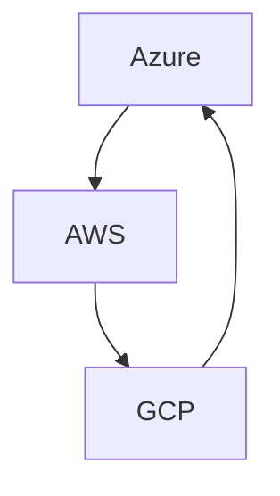
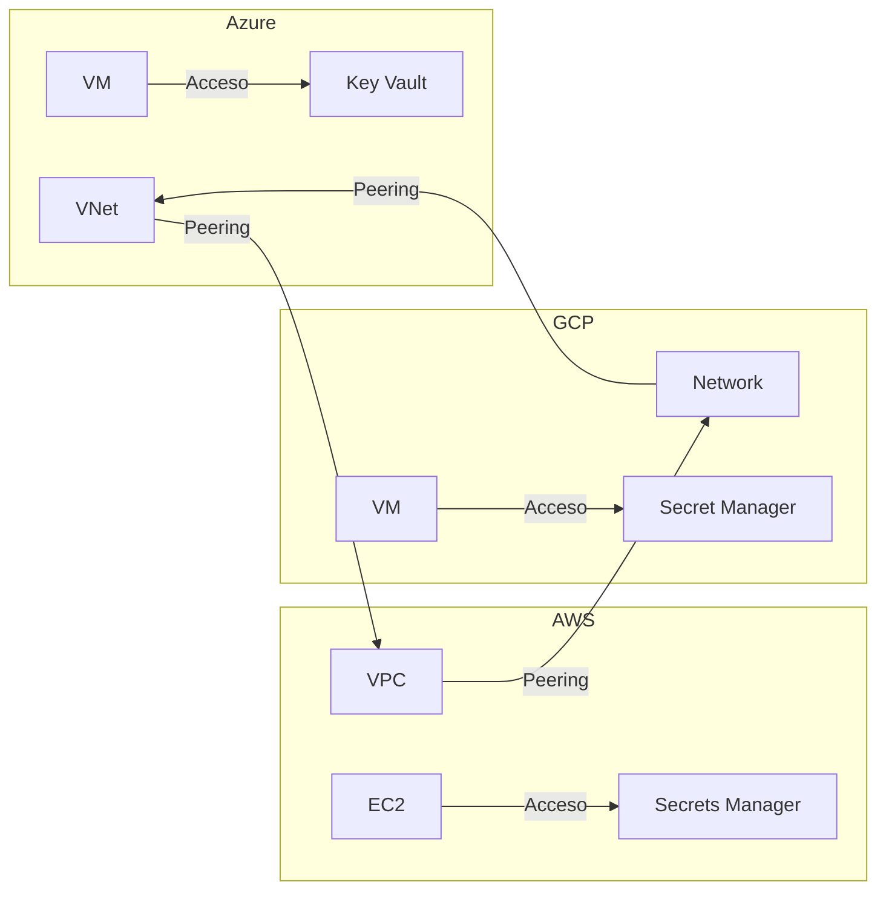

# Multi-Cloud Templates

[Badges de estado]

## Tabla de Contenidos

- Introducción
- Estructura del Repositorio
- Guía Rápida por Proveedor
- Ejemplo Multi-Cloud
- Mejores Prácticas Implementadas
- Validación y Seguridad
- Contribuir
- Licencia

## Diagramas de Arquitectura



Este repositorio contiene plantillas modulares para Azure, AWS y GCP.

## Propósito

Este repositorio sirve como ejemplo para programadores de infraestructura como código (IaC) que buscan implementar soluciones multi-cloud siguiendo las mejores prácticas recomendadas por Microsoft (Azure), Amazon (AWS) y Google (GCP).

## Características

- Plantillas modulares y reutilizables para cada proveedor cloud.
- Estructura y nomenclatura estandarizada.
- Ejemplos de implementación y despliegue.
- Documentación sobre mejores prácticas de seguridad, escalabilidad y mantenimiento.

## Mejores Prácticas

- **Azure:** Se siguen las [Azure Well-Architected Framework](https://learn.microsoft.com/azure/architecture/framework/) y las recomendaciones de seguridad y gobernanza de Microsoft.
- **AWS:** Se aplican las [AWS Well-Architected Framework](https://aws.amazon.com/architecture/well-architected/) y las guías de buenas prácticas de Amazon.
- **GCP:** Se implementan las [Google Cloud Architecture Framework](https://cloud.google.com/architecture/framework) y las recomendaciones de Google.

## Cómo usar este repositorio

1. Explora las carpetas de cada proveedor cloud.
2. Consulta los ejemplos y la documentación incluida.
3. Adapta las plantillas a tus necesidades siguiendo las mejores prácticas descritas.

## Estructura del Repositorio

```text
multi-cloud-templates/
├── azure/
│   ├── main.bicep
│   └── modules/
├── aws/
│   ├── main.tf
│   └── modules/
├── gcp/
│   ├── main.tf
│   └── modules/
├── environments/
│   ├── dev/
│   ├── test/
│   └── prod/
├── azure-pipelines.yml
├── CONTRIBUTING.md
├── LICENSE
└── README.md
```

- **/azure, /aws, /gcp:** Carpetas específicas para cada proveedor cloud que contienen módulos, plantillas y documentación relacionada.
- **/comun:** Recursos y módulos compartidos entre los diferentes proveedores cloud.
- **README.md:** Documentación principal del repositorio.
- **LICENSE:** Información sobre la licencia del repositorio.

## Guía Rápida por Proveedor

### Azure

```bash
az deployment group create --resource-group <grupo> --template-file azure/main.bicep --parameters @environments/dev/azure-parameters.json
```

### AWS

```bash
cd aws
terraform init
terraform apply -var-file=../environments/dev/terraform.tfvars
```

### GCP

```bash
cd gcp
terraform init
terraform apply -var-file=../environments/dev/terraform.tfvars
```

## Ejemplo Multi-Cloud

Puedes desplegar recursos en los tres proveedores ejecutando los scripts de cada carpeta o integrando los pasos en un pipeline CI/CD (ver `azure-pipelines.yml`).

## Ejemplo de Despliegue Completo Multi-Cloud

A continuación se muestra un ejemplo de cómo realizar un despliegue coordinado en los tres proveedores utilizando scripts y buenas prácticas:

### 1. Despliegue en Azure

```bash
az deployment group create --resource-group <grupo> --template-file azure/main.bicep --parameters @environments/dev/azure-parameters.json
```

### 2. Despliegue en AWS

```bash
cd aws
terraform init
terraform apply -var-file=../environments/dev/terraform.tfvars -auto-approve
```

### 3. Despliegue en GCP

```bash
cd gcp
terraform init
terraform apply -var-file=../environments/dev/terraform.tfvars -auto-approve
```

### 4. Orquestación desde un Script (opcional)

Puedes crear un script de automatización (por ejemplo, `deploy-all.ps1` en PowerShell):

```powershell
# Despliegue Azure
ez deployment group create --resource-group <grupo> --template-file azure/main.bicep --parameters @environments/dev/azure-parameters.json

# Despliegue AWS
cd aws
terraform init
terraform apply -var-file=../environments/dev/terraform.tfvars -auto-approve
cd ..

# Despliegue GCP
cd gcp
terraform init
terraform apply -var-file=../environments/dev/terraform.tfvars -auto-approve
cd ..
```

> **Consejo:** Personaliza los scripts para cada entorno (`dev`, `test`, `prod`) y utiliza variables de entorno para mayor seguridad.

## Validación y Seguridad

- **Azure:** Usa `bicep build` y `bicep linter` para validar las plantillas.
- **AWS/GCP:** Usa `terraform validate` y herramientas como `tfsec` o `checkov` para escaneo de seguridad.

## Validación Automática Multi-Cloud

Puedes validar todas las plantillas de Azure, AWS y GCP automáticamente ejecutando el siguiente script dentro del devcontainer:

```bash
./scripts/validate-all.sh
```

Este script realiza:

- Build y lint de plantillas Bicep (Azure)
- Init, validate y escaneo de seguridad (tfsec, checkov) para Terraform (AWS y GCP)

Asegúrate de tener permisos y credenciales configuradas si alguna validación requiere acceso a la nube.

---

## Mejores Prácticas Implementadas

A continuación se muestra cómo cada módulo sigue las recomendaciones de los frameworks Well-Architected de cada proveedor:

| Proveedor | Framework                                                                                     | Ejemplo de Mejores Prácticas                                                   |
| --------- | --------------------------------------------------------------------------------------------- | ------------------------------------------------------------------------------ |
| Azure     | [Azure Well-Architected Framework](https://learn.microsoft.com/azure/architecture/framework/) | Uso de módulos reutilizables, parámetros seguros, control de acceso y tagging. |
| AWS       | [AWS Well-Architected Framework](https://aws.amazon.com/architecture/well-architected/)       | Separación de recursos, variables parametrizadas, integración con IAM y VPC.   |
| GCP       | [Google Cloud Architecture Framework](https://cloud.google.com/architecture/framework)        | Modularidad, uso de variables, control de acceso y buenas prácticas de red.    |

## Diagramas Técnicos

### Diagrama de Red Multi-Cloud (Mermaid)



---

## Guía Avanzada: Orquestación Multi-Cloud con PowerShell

Puedes automatizar el despliegue y validación de todos los entornos con un script PowerShell:

```powershell
# Variables de entorno
$env:TF_VAR_env = "dev"
$resourceGroup = "mi-grupo"

# Despliegue Azure
az deployment group create --resource-group $resourceGroup --template-file azure/main.bicep --parameters @environments/$env/azure-parameters.json

# Validación Azure
bicep build azure/main.bicep
bicep linter azure/main.bicep

# Despliegue AWS
cd aws
terraform init
terraform apply -var-file=../environments/$env/terraform.tfvars -auto-approve

# Validación AWS
terraform validate
# Seguridad
if (Get-Command tfsec -ErrorAction SilentlyContinue) { tfsec . }
if (Get-Command checkov -ErrorAction SilentlyContinue) { checkov -d . }
cd ..

# Despliegue GCP
cd gcp
terraform init
terraform apply -var-file=../environments/$env/terraform.tfvars -auto-approve

# Validación GCP
terraform validate
if (Get-Command tfsec -ErrorAction SilentlyContinue) { tfsec . }
if (Get-Command checkov -ErrorAction SilentlyContinue) { checkov -d . }
cd ..
```

---

## Ejemplo de Validación Automática en CI/CD (Azure Pipelines)

Agrega los siguientes jobs a tu `azure-pipelines.yml` para validar automáticamente las plantillas en cada commit:

```yaml
trigger:
  - main

jobs:
  - job: Validate_Azure
    displayName: "Validar Bicep Azure"
    pool:
      vmImage: "ubuntu-latest"
    steps:
      - script: |
          bicep build azure/main.bicep
          bicep linter azure/main.bicep
        displayName: "Validar Bicep"

  - job: Validate_AWS
    displayName: "Validar Terraform AWS"
    pool:
      vmImage: "ubuntu-latest"
    steps:
      - script: |
          cd aws
          terraform init
          terraform validate
          if command -v tfsec; then tfsec .; fi
          if command -v checkov; then checkov -d .; fi
        displayName: "Validar Terraform AWS"

  - job: Validate_GCP
    displayName: "Validar Terraform GCP"
    pool:
      vmImage: "ubuntu-latest"
    steps:
      - script: |
          cd gcp
          terraform init
          terraform validate
          if command -v tfsec; then tfsec .; fi
          if command -v checkov; then checkov -d .; fi
        displayName: "Validar Terraform GCP"
```

---

## Ejemplo de Testing para AKS

Puedes probar automáticamente el despliegue de tu clúster AKS ejecutando el siguiente script después del despliegue:

```bash
./scripts/test-aks.sh <nombre-grupo-recursos> <nombre-aks>
```

Este script valida:

- Que el clúster AKS existe y está en estado Succeeded
- Que el node pool tiene al menos un nodo

Puedes extender este script para validar otros recursos o integrarlo en tu pipeline CI/CD.

---

## Ejemplo de Testing para AWS

Puedes probar automáticamente el despliegue de tus recursos en AWS ejecutando el siguiente script:

```bash
./scripts/test-aws.sh
```

Este script valida:

- Que la VPC con el tag Name=vpc-demo existe
- Que hay al menos una instancia EC2 en la VPC

---

## Ejemplo de Testing para GCP

Puedes probar automáticamente el despliegue de tus recursos en GCP ejecutando el siguiente script:

```bash
./scripts/test-gcp.sh
```

Este script valida:

- Que la red (network-demo) existe en el proyecto
- Que existe una VM llamada vm-demo en la red

Puedes adaptar los nombres de recursos según tu configuración de Terraform.

---

## Contribuir

Las contribuciones son bienvenidas. Por favor, lee el archivo [CONTRIBUTING.md](http://_vscodecontentref_/4) para más detalles sobre cómo contribuir a este repositorio.

## Licencia

Este proyecto está bajo la licencia [MIT](http://_vscodecontentref_/5).

## CI/CD Multi-Cloud con Azure Pipelines

Este repositorio incluye una pipeline unificada (`azure-pipelines.yml`) que valida, despliega y testea automáticamente la infraestructura en Azure, AWS y GCP. El flujo es el siguiente:

1. **Validación**
   - Azure: build y lint de plantillas Bicep.
   - AWS/GCP: init, validate y escaneo de seguridad (tfsec, checkov) para Terraform.
2. **Despliegue**
   - Azure: despliegue de recursos con Bicep.
   - AWS/GCP: despliegue de recursos con Terraform.
3. **Testing automático**
   - Azure: test de clúster AKS (`scripts/test-aks.sh`).
   - AWS: test de VPC e instancias EC2 (`scripts/test-aws.sh`).
   - GCP: test de red y VM (`scripts/test-gcp.sh`).

Puedes consultar y modificar la pipeline en el archivo `azure-pipelines.yml`.
