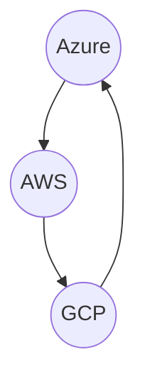
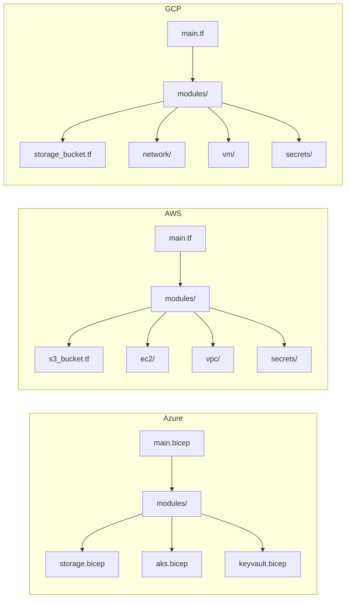
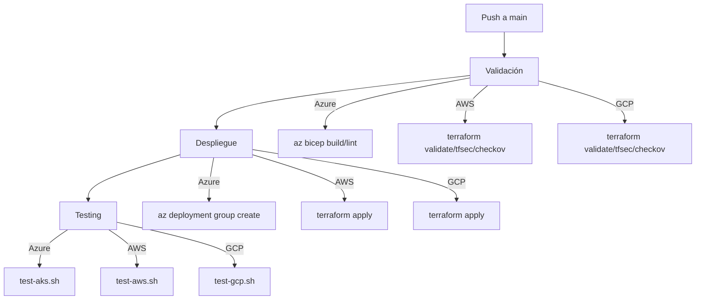
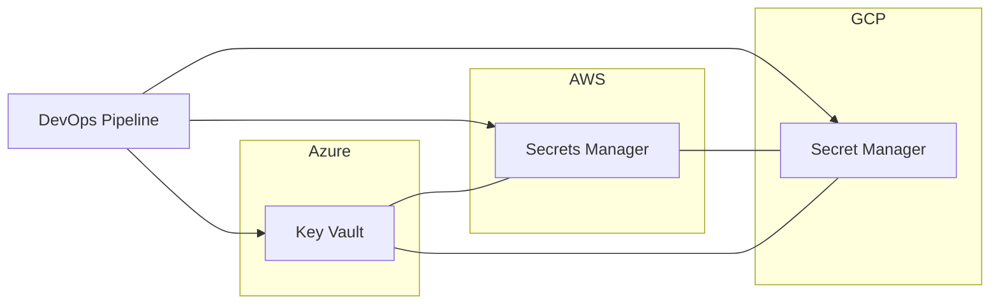

# Multi-Cloud Templates

[](https://github.com/davidop/multi-cloud-templates/actions/workflows/deploy-azure.yml)

## Tabla de Contenidos

- [Introducción](#introducción)
- [Propósito](#propósito)
- [Características](#características)
- [Estructura del Repositorio](#estructura-del-repositorio)
- [Diagramas de Arquitectura](#diagramas-de-arquitectura)
- [Diagramas de CI/CD y Testing](#diagramas-de-cicd-y-testing)
- [Diagramas de Gestión de Secretos](#diagramas-de-gestión-de-secretos)
- [Mejores Prácticas](#mejores-prácticas)
- [Guía Rápida por Proveedor](#guía-rápida-por-proveedor)
- [Ejemplo Multi-Cloud](#ejemplo-multi-cloud)
- [Validación y Seguridad](#validación-y-seguridad)
- [Testing Automático](#testing-automático)
- [CI/CD Multi-Cloud](#cicd-multi-cloud-con-azure-pipelines)
- [Metodología Recomendada](#metodología-recomendada)
- [Mejoras Propuestas](#mejoras-propuestas)
- [Contribuir](#contribuir)
- [Licencia](#licencia)

---

## Introducción

Este repositorio contiene plantillas modulares para Azure, AWS y GCP, facilitando la implementación de soluciones multi-cloud siguiendo las mejores prácticas de cada proveedor.

## Propósito

Sirve como ejemplo para programadores de infraestructura como código (IaC) que buscan implementar soluciones multi-cloud siguiendo las mejores prácticas recomendadas por Microsoft (Azure), Amazon (AWS) y Google (GCP).

## Características

- Plantillas modulares y reutilizables para cada proveedor cloud.
- Estructura y nomenclatura estandarizada.
- Ejemplos de implementación y despliegue.
- Documentación sobre mejores prácticas de seguridad, escalabilidad y mantenimiento.

## Estructura del Repositorio

> **Metodología recomendada:**  
> - **Azure:** Bicep (nativo, simple, integración directa con Azure)  
> - **AWS y GCP:** Terraform (modular, estándar multicloud, fácil de versionar y reutilizar)  
> - **Módulos reutilizables** por proveedor  
> - **Variables y configuración** por entorno (`dev`, `test`, `prod`)  
> - **Pipelines** para CI/CD y validación

```text
infra/
├── azure/         # Bicep para Azure
│   ├── main.bicep
│   └── modules/
├── aws/           # Terraform para AWS
│   ├── main.tf
│   └── modules/
├── gcp/           # Terraform para GCP
│   ├── main.tf
│   └── modules/
├── modules/       # (Opcional) Módulos reutilizables por proveedor
├── environments/  # dev / test / prod variables y parámetros
│   ├── dev/
│   ├── test/
│   └── prod/
├── scripts/       # Scripts de validación y testing automatizado
│   ├── validate-all.sh
│   ├── test-aks.sh
│   ├── test-aws.sh
│   └── test-gcp.sh
├── pipelines/     # GitHub Actions / Azure DevOps
│   └── azure-pipelines.yml
├── docs/          # Documentación extendida y ejemplos
├── CONTRIBUTING.md
├── LICENSE
└── README.md
```

- **/scripts:** Scripts para validación y testing automatizado.
- **/docs:** Documentación extendida, ejemplos y guías de uso.
- **/modules:** (Opcional) Módulos reutilizables por proveedor.
- **/environments:** Variables y parámetros por entorno.
- **/pipelines:** Definiciones de CI/CD.
- **README.md:** Documentación principal.
- **LICENSE:** Licencia del repositorio.

---

## Diagramas de Arquitectura

### Relación Multi-Cloud



### Diagrama de Arquitectura General Multi-Cloud


### Diagrama de Componentes de Módulos Reutilizables



---

## Diagramas de CI/CD y Testing

### Pipeline Multi-Cloud (CI/CD)



---

## Diagramas de Gestión de Secretos

### Gestión de Secretos Multi-Cloud



---

## Mejores Prácticas

- **Azure:** Se siguen las [Azure Well-Architected Framework](https://learn.microsoft.com/azure/architecture/framework/) y las recomendaciones de seguridad y gobernanza de Microsoft.
- **AWS:** Se aplican las [AWS Well-Architected Framework](https://aws.amazon.com/architecture/well-architected/) y las guías de buenas prácticas de Amazon.
- **GCP:** Se implementan las [Google Cloud Architecture Framework](https://cloud.google.com/architecture/framework) y las recomendaciones de Google.

| Proveedor | Framework                                                                                     | Ejemplo de Mejores Prácticas                                                   |
| --------- | --------------------------------------------------------------------------------------------- | ------------------------------------------------------------------------------ |
| Azure     | [Azure Well-Architected Framework](https://learn.microsoft.com/azure/architecture/framework/) | Uso de módulos reutilizables, parámetros seguros, control de acceso y tagging. |
| AWS       | [AWS Well-Architected Framework](https://aws.amazon.com/architecture/well-architected/)       | Separación de recursos, variables parametrizadas, integración con IAM y VPC.   |
| GCP       | [Google Cloud Architecture Framework](https://cloud.google.com/architecture/framework)        | Modularidad, uso de variables, control de acceso y buenas prácticas de red.    |

---

## Guía Rápida por Proveedor

### Azure (Bicep)

```bash
az deployment group create --resource-group <grupo> --template-file azure/main.bicep --parameters @environments/dev/azure-parameters.json
```

### AWS (Terraform)

```bash
cd aws
terraform init
terraform apply -var-file=../environments/dev/terraform.tfvars
```

### GCP (Terraform)

```bash
cd gcp
terraform init
terraform apply -var-file=../environments/dev/terraform.tfvars
```

---

## Ejemplo Multi-Cloud

Puedes desplegar recursos en los tres proveedores ejecutando los scripts de cada carpeta o integrando los pasos en un pipeline CI/CD.

### Despliegue Coordinado Multi-Cloud

```bash
# Azure
az deployment group create --resource-group <grupo> --template-file azure/main.bicep --parameters @environments/dev/azure-parameters.json

# AWS
cd aws
terraform init
terraform apply -var-file=../environments/dev/terraform.tfvars -auto-approve
cd ..

# GCP
cd gcp
terraform init
terraform apply -var-file=../environments/dev/terraform.tfvars -auto-approve
cd ..
```

> **Consejo:** Personaliza los scripts para cada entorno (`dev`, `test`, `prod`) y utiliza variables de entorno para mayor seguridad.

---

## Validación y Seguridad

- **Azure:** Usa `bicep build` y `bicep linter` para validar las plantillas.
- **AWS/GCP:** Usa `terraform validate` y herramientas como `tfsec` o `checkov` para escaneo de seguridad.

### Validación Automática Multi-Cloud

Puedes validar todas las plantillas de Azure, AWS y GCP automáticamente ejecutando el siguiente script dentro del devcontainer:

```bash
./scripts/validate-all.sh
```

Este script realiza:

- Build y lint de plantillas Bicep (Azure)
- Init, validate y escaneo de seguridad (tfsec, checkov) para Terraform (AWS y GCP)

Asegúrate de tener permisos y credenciales configuradas si alguna validación requiere acceso a la nube.

---

## Testing Automático

- **Azure:** `./scripts/test-aks.sh <nombre-grupo-recursos> <nombre-aks>`
- **AWS:** `./scripts/test-aws.sh`
- **GCP:** `./scripts/test-gcp.sh`

Estos scripts validan la existencia y estado de los recursos principales desplegados en cada proveedor.

---

## CI/CD Multi-Cloud con Azure Pipelines

Este repositorio incluye una pipeline unificada (`azure-pipelines.yml`) que valida, despliega y testea automáticamente la infraestructura en Azure, AWS y GCP. El flujo es el siguiente:

1. **Validación**
   - Azure: build y lint de plantillas Bicep.
   - AWS/GCP: init, validate y escaneo de seguridad (tfsec, checkov) para Terraform.
2. **Despliegue**
   - Azure: despliegue de recursos con Bicep.
   - AWS/GCP: despliegue de recursos con Terraform.
3. **Testing automático**
   - Azure: test de clúster AKS (`scripts/test-aks.sh`).
   - AWS: test de VPC e instancias EC2 (`scripts/test-aws.sh`).
   - GCP: test de red y VM (`scripts/test-gcp.sh`).

Puedes consultar y modificar la pipeline en el archivo `pipelines/azure-pipelines.yml`.

---

## Metodología Recomendada

- **Azure:** Mantén Bicep como estándar para equipos que trabajan solo con Azure.
- **AWS y GCP:** Usa Terraform como lenguaje común para equipos multicloud.
- **Módulos reutilizables:** Organiza módulos por proveedor y reutiliza lógica donde sea posible.
- **Variables y configuración por entorno:** Centraliza parámetros y variables en `/environments`.
- **Automatización:** Usa pipelines para validación, despliegue y testing automático.
- **Gestión de secretos:** Utiliza Key Vault (Azure), Secrets Manager (AWS) y Secret Manager (GCP) según el entorno.

Esta metodología permite a cada equipo trabajar con la herramienta más eficiente para su entorno, sin sacrificar la coherencia ni la trazabilidad de las implementaciones.

---

## Mejoras Propuestas

1. **Unificar la estructura bajo `/infra/`**  
   Mueve todas las carpetas de proveedores y entornos bajo una raíz común (`/infra/`) para mayor claridad y escalabilidad.
2. **Agregar carpeta `/scripts/`**  
   Centraliza scripts de validación, testing y automatización para facilitar su mantenimiento y descubrimiento.
3. **Crear carpeta `/docs/`**  
   Incluye documentación extendida, diagramas, ejemplos de uso y guías de buenas prácticas.
4. **Ejemplos de módulos reutilizables**  
   Añade ejemplos de módulos reutilizables para cada proveedor en `/infra/modules/` y referencia su uso en la documentación.
5. **Automatización avanzada en CI/CD**  
   - Añade jobs de lint y seguridad para Terraform (`tflint`, `tfsec`, `checkov`).
   - Añade jobs de testing post-deploy usando los scripts de `/scripts/`.
   - Publica artefactos de validación y reportes de seguridad en cada pipeline.
6. **Documentación de patrones de integración multicloud**  
   En `/docs/`, incluye ejemplos de patrones de integración entre clouds (por ejemplo, peering entre Azure y AWS, sincronización de secretos, etc).
7. **Plantillas de issues y PRs**  
   Añade archivos `.github/ISSUE_TEMPLATE/` y `.github/pull_request_template.md` para estandarizar la colaboración.
8. **Ejemplo de gestión de secretos**  
   Documenta y ejemplifica cómo gestionar secretos de forma segura en cada cloud y cómo integrarlo en pipelines.
9. **Guía de migración y adopción**  
   Incluye una guía para equipos que migran de un solo cloud a multicloud, con recomendaciones de adopción progresiva.
10. **Badges de estado adicionales**  
    Añade badges para validación de AWS, GCP y cobertura de tests.

---

Adoptando esta estructura y ejemplos, tu repositorio será más escalable, colaborativo y fácil de mantener para equipos multicloud.
