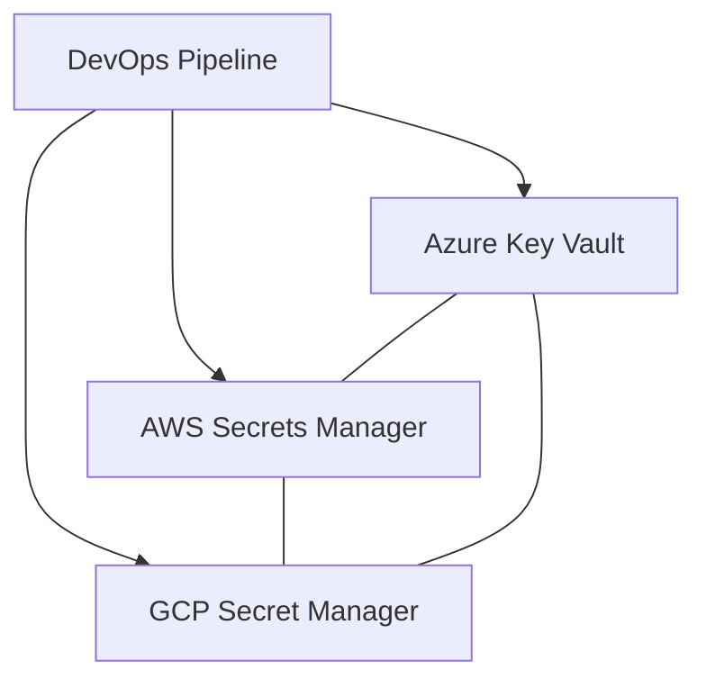

# Guía de gestión de secretos multi-cloud

Esta guía explica cómo gestionar secretos de forma segura en Azure, AWS y GCP, y cómo integrarlo en pipelines CI/CD.

## Diagrama de flujo de gestión de secretos

- **Azure:** Usar Key Vault
- **AWS:** Usar Secrets Manager
- **GCP:** Usar Secret Manager

Incluye ejemplos de uso y buenas prácticas.
