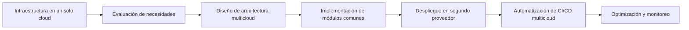

# Guía de migración y adopción multicloud

Recomendaciones para equipos que migran de un solo cloud a una estrategia multicloud, incluyendo pasos progresivos y mejores prácticas de adopción.

## Diagrama de migración progresiva

