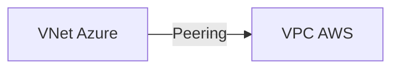
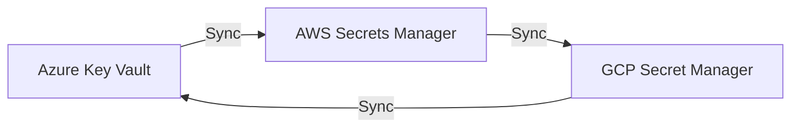
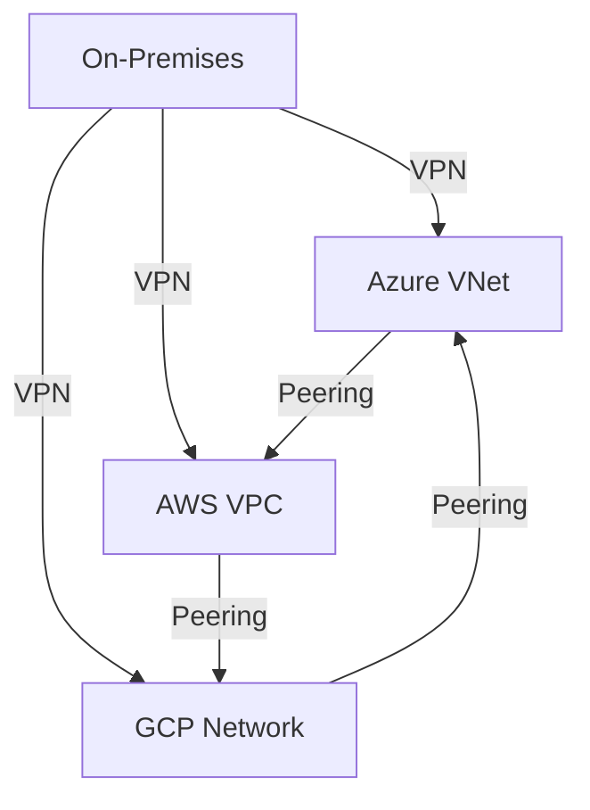

# Ejemplos de integración multicloud

Aquí se documentan patrones y ejemplos de integración entre proveedores cloud, como peering de redes, sincronización de secretos, etc.

## Ejemplo: Peering entre Azure y AWS

## Ejemplo: Sincronización de secretos entre clouds

## Ejemplo: Arquitectura de red híbrida

